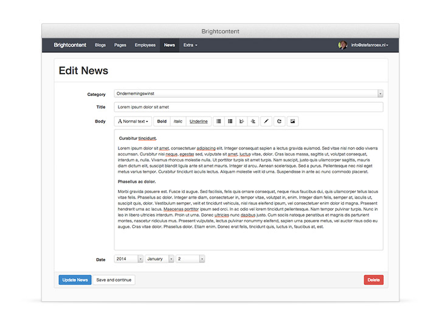

Brightcontent
=============

[](http://badge.fury.io/rb/brightcontent)
[](https://codeclimate.com/github/brightin/brightcontent)
[](https://travis-ci.org/brightin/brightcontent)

Brightcontent, yet another rails CMS / admin panel

* For *developers*, to make a *custom CMS* for *non-technical users*
* No standard 'cms-modules', we hate those, making custom is easy enough
* Built in the rails way, use your normals models, only controllers and views are provided
* Only exception: Page model is provided with tree structure, sorting, hidden and pretty urls like `/services/cleaning/houses`
* Supports Rails 4.2 and above
* Strong Parameters support


Installation
------------

Include the gem in your Gemfile:

```ruby
gem "brightcontent"
bundle install
```

Generate the initializer, copy migrations and edit routes file. This can be done via a generator. Migrate the database afterwards:

    $ rails generate brightcontent:install
    $ rails generate brightcontent:pages:install
    $ rails generate brightcontent:attachments:install
    $ rake db:migrate

Go to `/admin` and login with default user (email: `admin@example.com` / password: `password`).

Add a resource to Brightcontent
-------------------------------

Lets say, we want to add projects. Just create the `Project` model the rails way:

    $ rails g model Project name:string description:text
    $ rake db:migrate

To add the resource to brightcontent run:

    $ rails generate brightcontent:resource Project

Gratz! Projects can now be controlled with Brightcontent.

Filters
-------

Using `filter_fields` you may define filters for your index pages:

```ruby
class BlogsController < Brightcontent::BaseController
  filter_fields :author, :name
end
```

The above will render two filters on the blogs index page. Blog belongs to Author, therefore by default the filter is displayed as a drop-down list containing all authors that have blogs. The name-filter is displayed as a drop-down list containing all values for the `name` attribute found in the blogs table.

### Options

In order to control the way filters are displayed and how they behave you can supply options:

```ruby
# Supplying options:
filter_fields author: { ... }, name: { ... }

# Combining filters without options and filters with options:
filter_fields :author, name: { ... }
```

Basically all options are delegated to `SimpleForm::FormBuilder#input`, such as `:as`, `:input_html`, and `:label_method`. Refer to [Simple Form's documentation](http://www.rubydoc.info/github/plataformatec/simple_form/master/SimpleForm/FormBuilder#input-instance_method) for more information.

#### Other options

##### <tt>:collection</tt>

Extends SimpleForm's `:collection` option. It also accepts a Proc, or method name as a symbol. It defaults to either a list of all existing values for the corresponding attribute or a list of all associated records in case of a belongs-to relationship.

##### <tt>:predicate</tt>

Allows for specifying the Ransack search predicate to be used. Set it to `false` to avoid a predicate. Defaults to "cont" (contains) for string type filters (`:string` or `:search`) and to "eq" (equals) for all other types. It defaults to `false` if the field name refers to [a ransackable scope](https://github.com/activerecord-hackery/ransack#using-scopesclass-methods). For more information refer to [Ransack's documentation](https://github.com/activerecord-hackery/ransack/wiki/Basic-Searching).

### Examples

```ruby
class BlogsController < Brightcontent::BaseController
  # Two default drop-down list filters:
  filter_fields :name, :author

  # Free form text filter, returns all blogs where name contains given query:
  filter_fields name: { as: :string, predicate: "cont" }

  # Same as above:
  filter_fields name: { as: :string }

  # Customized label:
  filter_fields author: { label: "Written by" }

  # Select filter with custom options:
  filter_fields name: { collection: ["Game reviews", "Programming tips", "Arthur's blog"] }

  # Belongs-to filter with custom options:
  filter_fields author: { collection: ->{ Author.order(:name) }, label_method: :display_name }

  # Or by means of a controller method:
  filter_fields author: { collection: :published_authors }

  # Or even a fully customized filter, using a fictitious custom SimpleForm input field:
  filter_fields author: { as: :remote_select, url: "/authors.json?order=name" }

  # Filter by start date:
  filter_fields created_at: { as: :date, predicate: "gteq", label: "Posted since" }

  # Filter by scope (see definition of Blog below):
  filter_fields exclude_inactive: { as: :select, collection: [["Yes", true], ["No", false]] }

  private

  def published_authors
    Author.published
  end
end

def Blog < ActiveRecord::Base
  scope :exclude_inactive, ->{ where(active: true) }

  def self.ransackable_scopes(auth_object = nil)
    [:exclude_inactive]
  end
end
```

Pages
-----

Pages gives you a Page model with tree structure and pretty urls. Every page relates to a specific path. For example, you could create a page with the path `/about/team`. The page is available on the url via `current_page`.

This adds an extra layer on top of your existing routes. However when there aren't any routes available for the specific url, Rails cannot render the page. Therefore it is best to add a catch-all route (at the very bottom of the file) for all general pages:

```ruby
get "*path" => "pages#show", constraints: Brightcontent::Pages::PathConstraint.new
```

Pagination
----------

The number of pages can be set in a controller by calling `per_page 50`.

If multiple page sizes are preferred, you can provide those sizes with

``` ruby
page_size_options [10, 25, 50, 100]
```

This will set the default page size to `10` and inject 4 page size options in
the index views. The `per_page` value (if provided), will be ignored.
